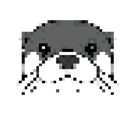

# Otto

<p align="center">
  
</p>

Otto is a Chrome extension side assistant for chatting with the current page.

It supports:
- quick page and selection context from keyboard shortcuts
- a sidepanel chat UI with OpenAI or Anthropic models
- slash-style saved skills
- copyable responses for rewrite/edit workflows

## Add To Chrome

1. Install dependencies:

```bash
npm install
```

2. Build the extension:

```bash
npm run build
```

3. Open Chrome and go to `chrome://extensions`
4. Turn on **Developer mode**
5. Click **Load unpacked**
6. Select the `dist/` folder from this project

## Shortcuts

- `⌘⇧l` / `Ctrl+Shift+l`: open with selected text and page context
- `⌘⇧u` / `Ctrl+Shift+U`: attach the current page
- `⌘⇧o` / `Ctrl+Shift+o`: open the extension

Shortcut bindings can be changed in `chrome://extensions/shortcuts`.

## Notes

- API keys are configured inside the extension settings
- After code changes, rebuild and reload the unpacked extension in Chrome
